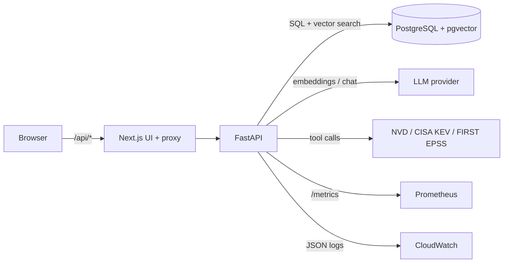

# AI Cybersecurity Platform

[](https://github.com/parth25366-creator/ai-cybersecurity-platform/actions/workflows/ci.yml)

A security-analyst assistant. Ask about a CVE or an incident and an LLM agent answers using **your own playbooks**
(retrieval-augmented generation) plus **live threat intelligence** (NIST NVD, CISA KEV, FIRST EPSS). Built as a
secure-by-design full-stack app: role-based access control, audit trail, rate limiting, prompt-injection defences and a
written [threat model](docs/threat-model.md).

## What it does
- **Grounded answers with sources**: retrieves relevant chunks from uploaded playbooks/advisories and cites them.
- **Agent with tools**: decides when to search the knowledge base, look up a CVE (NVD), or check whether it is
  actively exploited (CISA Known Exploited Vulnerabilities + EPSS score). Multi-step, capped at 5 steps.
- **Document ingestion**: upload `.pdf`, `.txt`, `.md` (or `POST /kb`); split, embedded and stored in pgvector.
- **RBAC**: `admin` / `analyst` / `viewer`. Analysts add knowledge, admins manage roles and read the audit log.
- **Observability**: JSON logs, Prometheus metrics at `/metrics`, per-request timing, audit table.

## Architecture


**Agent loop:** question -> model picks tools (`SearchKB`, `LookupCVE`, `ExploitStatus`) -> tool results (fenced as
untrusted data) go back to the model -> final answer plus the list of tools used. Every chat is written to the audit log.

## Tech stack
| Layer | Choice | Why |
|-------|--------|-----|
| Frontend | Next.js 15, React 19, TypeScript | Server-side proxy avoids CORS; security headers set centrally |
| API | FastAPI, SQLModel, Pydantic v2 | Typed validation on every input; auto OpenAPI docs at `/docs` |
| Data | PostgreSQL 16 + **pgvector** (HNSW index) | One database for relational data and embeddings, no extra vector service |
| AI | OpenAI-compatible client (OpenAI or Gemini), tool calling | Provider is swappable through env vars |
| Auth | JWT (PyJWT), Argon2 (pwdlib), `limits` for rate limiting | Small, well-known libraries instead of hand-rolled crypto |
| Ops | Docker Compose, GitHub Actions, structlog, prometheus-fastapi-instrumentator | Reproducible run, CI on every push |

## Quick start
```bash
cp .env.example .env        # set OPENAI_API_KEY and JWT_SECRET (openssl rand -hex 32)
docker compose up --build
# UI  http://localhost:3000      API docs  http://localhost:8000/docs
```
The first account you register becomes `admin`; everyone after is `viewer`. Promote users with
`PATCH /users/{id}/role?role=analyst` (list ids with `GET /users`). Set `OPEN_REGISTRATION=false` to close signup.

**Free option:** Google's Gemini API has a free tier with an OpenAI-compatible endpoint. Set `LLM_BASE_URL`, `CHAT_MODEL`
and `EMBED_MODEL` as shown in `.env.example`.

## API
| Method | Path | Role | Purpose |
|--------|------|------|---------|
| POST | `/auth/register`, `/auth/login` | public | Create account / get JWT (login limited to 5/min per account) |
| POST | `/chat` | any user | Ask the agent (10/min per user) |
| POST | `/kb`, `/kb/upload` | analyst, admin | Add text or a file to the knowledge base |
| GET/PATCH | `/users`, `/users/{id}/role` | admin | List users, change roles |
| GET | `/audit` | admin | Last 100 audit events |
| GET | `/health`, `/metrics` | public | Liveness, Prometheus metrics |

## Testing and CI
```bash
cd backend && pip install -r requirements-dev.txt && pytest -q && ruff check . && bandit -q -r app -ll
```
28 tests run without network or database (SQLite, stubbed LLM): registration and login, argon2 storage, brute-force limiting,
**forged / `alg=none` / expired tokens**, RBAC on every privileged route, immediate role changes, upload validation, the
agent loop (step limit, tool errors), tool-input validation and prompt-injection fencing. GitHub Actions also builds the
frontend and the Docker images on every push, and Dependabot keeps dependencies current.

## Security
See [docs/threat-model.md](docs/threat-model.md) for the threats considered, the control and test for each, and the
limitations that remain (prompt injection is mitigated, not solved; single shared knowledge base; in-memory rate limiter).

## Deploying to AWS
ECR (two images) -> ECS Fargate (frontend behind an ALB with TLS; backend private via Service Connect; build the frontend
with `--build-arg BACKEND_URL=http://backend:8000`) -> RDS PostgreSQL 16 (pgvector is supported; run
`CREATE EXTENSION vector` once). Secrets from Secrets Manager; logs via the `awslogs` driver to CloudWatch (already JSON);
scrape `/metrics` with the AWS Distro for OpenTelemetry. Not yet automated.

## Roadmap
Alembic migrations, Redis-backed rate limiting, streaming responses, per-user knowledge bases, Terraform for AWS,
retrieval evaluation set (hit-rate / MRR), CSP header, MFA.

## License
MIT
